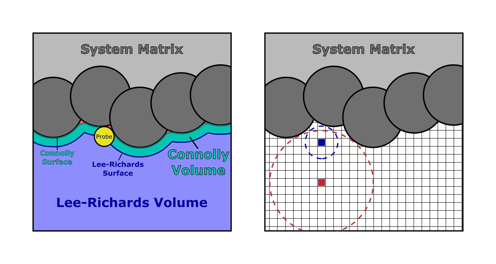

# Probe-Occupiable Volume Analysis Tools (PrO-VAT)

Developed by: Nico Marioni, nmarioni@seas.upenn.edu
 - Developed using Python 3.12.X
   - Packages: PyYAML 6.0.3, numpy 2.3.3+, h5py 3.14.0+, MDAnalysis 2.9.0+, igraph 1.0.0, scikit-image 0.25.0+, porespy 3.0.4, openpnm 3.6.1

PrO-VAT calculates the pore size distribution (free volume distribution, channel width distribution, etc) of the van der Waals volume of the defined system matrix from a GROMACS (gro/xtc/trr + tpr/gro) or PoreBlazer-style (xyz + dat) trajectory. This software was specifically desgined to find the distribution of water-rich pores within a hydrated polymer system, but can be generalized to any atomic or coarse-grained system. The output includes the Cumulative Pore Size Distribution (Cumulative PSD), Pore Size Distribution (PSD), and Free Volume Fraction (Fractional Free Volume, FFV), with optional Surface Area (SA), Tortuosity (Tau), and xyz visualizations. This software was written based on the methods used for [PoreBlazer v4.0](https://github.com/SarkisovGitHub/PoreBlazer) (https://doi.org/10.1021/acs.chemmater.0c03575) and is optimized for parallelized calculations over many system frames, or analysis of large (30+ nm box length) systems.


## Methodology

Briefly, PrO-VAT probes the van der Waals free volume of a defined system matrix. The probed free volume can be further refined to the largest continuous cluster (assumed percolated) or only free volume clusters which contain solvent atoms. See --solvent_name in config.yaml for more details. The free volume is segregated into the Connolly (probe-occupiable) and Lee-Richards (surface-accessible) volumes, where the surface of the Connolly and Lee-Richards volumes are traced by the edge and center of a probe of defined radius as it is "rolled across" the volume of the system matrix. (see the left-hand side of the image below). The Connolly volume is used to measure the PSD, Connolly FFV, and Connolly SA. The Lee-Richards volume is used to measure the Lee-Richards FFV, Lee-Richards, SA, and Tau.

Algorithmically, the free volume is determined as follows. First, the system box is divided into voxels. For each voxel, the largest voxel-centered free volume sphere without overlapping the system matrix is calculated, where free volume spheres of radius *r* >= probe_radius define the Connolly volume. A cluster analysis is optionally applied to only consider the largest cluster of free volume spheres, or only free volume clusters which contain solvent atoms. To calculate the Cumulative PSD, we calculate the largest free volume sphere that contains each voxel center that lies outside the system matrix (see the right-hand side of the image below, where the blue circle is the largest sphere centered on the blue voxel, and the right circle is the largest sphere that contains the blue voxel). The Cumulative PSD is defined as the probability that a random voxel center within the free volume resies within a free volume sphere of diameter *d* or smaller. From this definition, the PSD is defined as the derivative of the Cumulative PSD with respect to *d*. The FFV is calculated as the fraction of total voxels in the Connolly and Lee-Richards volumes. The SA is calculated using a scikit-image [surface mesh](https://scikit-image.org/docs/stable/api/skimage.measure.html#skimage.measure.mesh_surface_area) determined by a simple [marching cubes](https://scikit-image.org/docs/stable/api/skimage.measure.html#skimage.measure.marching_cubes) algorithm applied to the Connolly and Lee-Richards volumes. The tortuosity is calculated using [PoreSpy](https://porespy.org/examples/simulations/reference/tortuosity_fd.html) on the Lee-Richards volume.



## Getting started

Installation
 - Install Python 3.12.X
   - PrO-VAT may work with other python versions
 - python3 -m pip install PyYAML numpy h5py MDAnalysis igraph scikit-image porespy openpnm

PrO-VAT requires the following inputs:
 - ```python3 PrO-VAT.py {YAML} {Mode} {Trajectory} {Topology} {Optional arguments}```
   - **YAML:** "config.yaml", configuration file containing default PrO-VAT inputs
     - ```python3 PrO-VAT.py -h``` for more information
   - **Mode:** "xyz" or "gmx" for PoreBlazer-style or GROMACS trajectory input, respectively
     - ```python3 PrO-VAT.py {YAML} -h``` for more information
   - **Trajectory:** xyz or xtc/trr/gro file input for "xyz" or "gmx" mode, respectively
   - **Topology:** dat or tpr/gro file input for "xyz" or "gmx" mode, respectively. Note, gro files contain less topology information than tpr files
     - **NOTE:** PrO-VAT reads in data using [MDAnalysis](https://userguide.mdanalysis.org/stable/formats/index.html), and therefore can be adapted to other trajectory and topology formats (see the "load_trajectory()" function in PrO-VAT.py), e.g., LAMMPS
   - **Optional arguments:** additional (optional) arguments can be added to overwrite the default settings defined in {**YAML**}
     - e.g., "-r 1.4" or "--probe_radius 1.4"
     - ```python3 PrO-VAT.py {YAML} {Mode} -h``` for more information
 - **NOTE:** PrO-VAT must be run twice: First to generate a PrO-VAT.hdf5 run file, second to perform the analysis.
   - If PrO-VAT successfully runs the second time, it will delete the PrO-VAT.hdf5 file. However, make sure to delete this file and rebuild it if you change the inputs for PrO-VAT (yaml file or arguments) in between analysis attempts.

## Repository Contents

### Files
 - **PrO-VAT.py:** python analysis software
 - **config.yaml:** yaml file containing default inputs for PrO-VAT
   - See the file for more details on each input
 - **run.sh:** bash script describing how to perform the analysis for two example systems
   - See the file for more details on running PrO-VAT

### Examples
 - **/xyz/:** example analysis on a PoreBlazer-style xyz/dat trajectory input for PrO-VAT
   - Example system contains an anion exchange membrane from: https://doi.org/10.1021/acs.macromol.5c01789
     - *p*5CNMe3 - *λ* = 10
 - **/gmx/:** example analysis on a GROMACS gro/gro (similarly gro/tpr, xtc/tpr, trr/tpr) input for PrO-VAT
   - Example system contains a cation exchange membrane from: https://doi.org/10.1021/jacsau.5c00218
     - *p*5PhSH - *Y* = 70, *λ* = 9
 - **NOTE:** It is recommended to average results over many different frames and several indpendent repeats for the best results. This just serves as a simple, fast to analyze example of using PrO-VAT.

### Example files and folders
 - xyz input files:
   - **/xyz/polymer_matrix.xyz:** XYZ file that defines the atoms making up the polymer matrix, i.e., the solvent domain has been deleted to probe the solvent-phase PSD, etc
   - **/xyz/input.dat:** input file that defines the box size for PrO-VAT
     - See the file for more details on creating and formatting the file
 - gmx input files:
   - **/gmx/md.gro:** GROMACS gro file defining the atom positions and limited topology information
 - **/{xyz/gmx}/output.txt:** an example of PrO-VAT's output when it is run as shown in run.sh
   - NOTE: PrO-VAT must be run twice. First to generate a data file, then to calculate the PSD, etc
 - **/{xyz/gmx}/Example_output_files/:** contains example files generated when PrO-VAT is run as shown in run.sh
   - PSD.dat: pore size distribution (PSD, or free volume distribution, channel width distribution, etc)
   - Cumulative_PSD.dat: cumulative PSD, where the PSD is the derivative of this profile
   - PSD_Plot.xlsx: excel plot of the cumulative PSD and PSD
   - FFV.dat: Connolly and Lee-Richards volume fraction (FFV, free volume fraction, water volume fraction, porosity, etc)
   - SA.dat: a simple marching-cubes mesh surface area calculation ([scikit-image](https://scikit-image.org/)) of the Connolly and Lee-Richards pore surface
     - **NOTE:** The SA calculation requires --Voxel_dist 'Uniform' and --tol -1 (see "Surface_area" in "config.yaml")
   - Tau.dat: 1D diffusional tortuosity of the percolated domain in the X, Y, and Z direction using simple Fickian diffusion algorithm ([PoreSpy](https://porespy.org/)/[OpenPNM](https://openpnm.org/))
     - Tortuosity does not account for PBCs and applies to the Lee-Richards volume
     - **NOTE:** Tortuosity calculation is memory intensive. Larger --L_voxel may be needed for large systems
     - **NOTE:** The tortuosity calculation requires --Voxel_dist 'Uniform' and --tol -1 (see "Tortuosity" in "config.yaml")
   - {}.xyz: xyz files to visualize the free volume probed by PrO-VAT using OVITO
     - Free_Volume_Spheres visualizes the free volume *spheres* of maximum radius *probe_radius* (defined in "config.yaml") which make up the probe-occupiable free volume
     - Free_Volume_Voxels visualizes the free volume *voxels* of side length *L_voxel* (defined in "config.yaml") which make up the probe-occupiable free volume
     - Free_Volume_Surface visualizes the free volume *voxels* of side length *L_voxel* (defined in "config.yaml") which defines the surface of the probe-occupiable free volume
       - "X" particles define the Connolly surface while "Y" particles define the Lee-Richards "Surface-accessible surface
       - **NOTE:** voxels are are centered on the voxel face at the surface
   - Example.ovito: OVITO visualization state showing the above. Created using [OVITO(-basic) version 3.7.12](https://www.ovito.org/download_history/)
     - In the top right, you can select the different xyz files (pipelines) and turn on and off the Particles (under "Visual elements")

## Acknowledgements

PrO-VAT was developed in continuation of [**/PyAnalysis/analysis_PSD_Voxel.py**](https://github.com/Ganesan-Group-Codes-and-Analysis/PolyAnalysis) (https://doi.org/10.1016/j.memsci.2025.124837) by the same author. The development of analysis_PSD_Voxel was supported as part of the Center for Materials for Water Energy Systems (M-WET), an Energy Frontier Research Center funded by the U.S. Department of Energy, Office of Science, Basic Energy Sciences, under Award #DE-SC0019272.

The development of PrO-VAT was supported by the Department of Energy (DOE)-Basic Energy Science (BES) program under Grant #DE-SC0023386. PrO-VAT is research software. If you make use of PrO-VAT in scientific publications, please cite the following:
 - Add Zenodo DOI

Publications using PrO-VAT:
 - Wang, L.; Kronenberger, S.; Marioni, N.; Frischknecht, A.L.; Jayaraman, A.; Winey, K.I. *In Preparation* **2026**.

We thank [MDAnalysis](https://www.mdanalysis.org/) for simulation trajectory reading and analysis tools, [igraph](https://igraph.org/) for graphing/cluster analysis tools, [scikit-image](https://scikit-image.org/) for surface area analysis tools, and [PoreSpy](https://porespy.org/)/[OpenPNM](https://openpnm.org/) for tortuosity analysis tools.