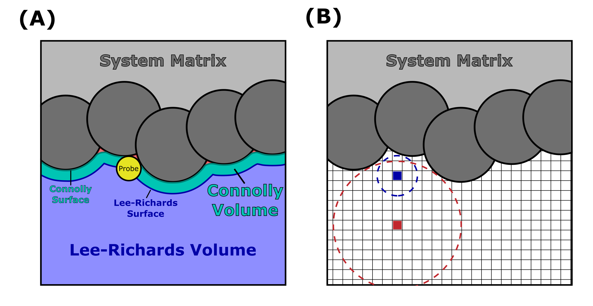
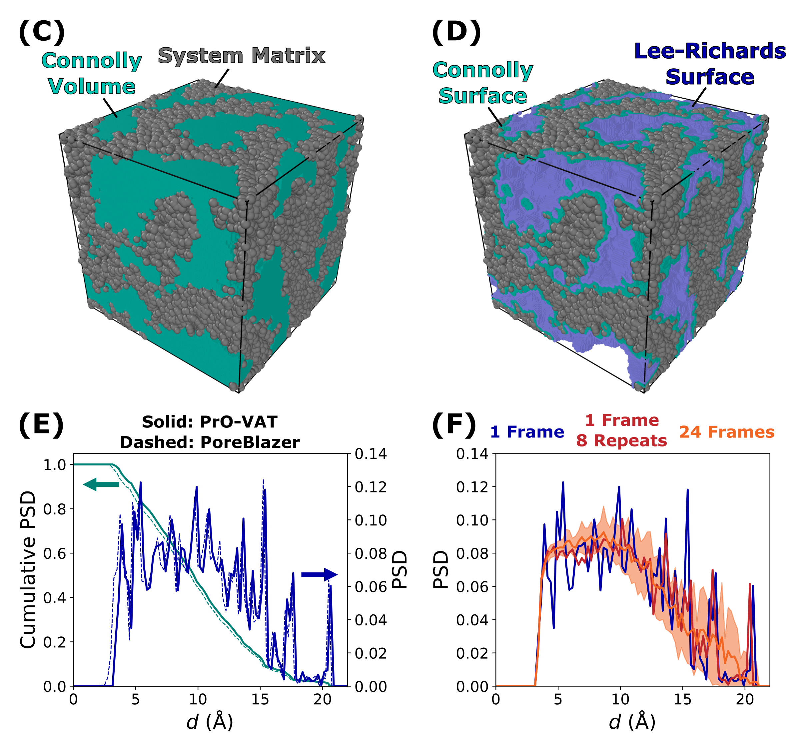

# Probe-Occupiable Volume Analysis Tools (PrO-VAT)

Developed by: Nico Marioni, nmarioni@seas.upenn.edu
 - Developed using Python 3.12.X
   - Packages: PyYAML 6.0.3, numpy 2.3.3+, h5py 3.14.0+, MDAnalysis 2.9.0+, python-igraph 1.0.0, scikit-image 0.25.0+, porespy 3.0.4, openpnm 3.6.1

PrO-VAT calculates the pore size distribution (free volume distribution, channel width distribution, etc) of the van der Waals volume of the defined system matrix from a GROMACS (gro/xtc/trr + tpr/gro) or PoreBlazer-style (xyz + dat) trajectory. This software was specifically designed to find the distribution of water-rich pores within a hydrated polymer system, but can be generalized to any atomic or coarse-grained system. The output includes the Cumulative Pore Size Distribution (Cumulative PSD), Pore Size Distribution (PSD), and Free Volume Fraction (Fractional Free Volume, FFV), with optional Surface Area (SA), Tortuosity (Tau), and xyz visualizations. This software was written based on the methods used for [PoreBlazer v4.0](https://github.com/SarkisovGitHub/PoreBlazer) ([Publication](https://doi.org/10.1021/acs.chemmater.0c03575)) and is optimized for parallelized calculations over many system frames, or analysis of large (30+ nm box length) systems.


## Methodology

Briefly, PrO-VAT probes the van der Waals free volume of a defined system matrix. The probed free volume can be further refined to the largest continuous cluster (assumed percolated) or only free volume clusters which contain solvent atoms. See --solvent_name in config.yaml for more details. The free volume is segregated into the Connolly (probe-occupiable) and Lee-Richards (surface-accessible) volumes, where the surface of the Connolly and Lee-Richards volumes are traced by the edge and center of a probe of defined radius as it is "rolled across" the volume of the system matrix. (see **Figure A**). The Connolly volume is used to measure the PSD, Connolly FFV, and Connolly SA. The Lee-Richards volume is used to measure the Lee-Richards FFV, Lee-Richards, SA, and Tau-.

Algorithmically, the free volume is determined as follows. First, the system box is divided into voxels. For each voxel, the largest voxel-centered free volume sphere without overlapping the system matrix is calculated, where free volume spheres of radius *r* >= probe_radius define the Connolly volume. A cluster analysis is optionally applied to only consider the largest cluster of free volume spheres, or only free volume clusters which contain solvent atoms. To calculate the Cumulative PSD, we calculate the largest free volume sphere that contains each voxel center that lies outside the system matrix (see **Figure B**, where the blue circle is the largest sphere centered on the blue voxel, and the right circle is the largest sphere that contains the blue voxel). The Cumulative PSD is defined as the probability that a random voxel center within the free volume resides within a free volume sphere of diameter *d* or smaller. From this definition, the PSD is defined as the derivative of the Cumulative PSD with respect to *d*. The FFV is calculated as the fraction of total voxels in the Connolly and Lee-Richards volumes. The SA is calculated using a scikit-image [surface mesh](https://scikit-image.org/docs/stable/api/skimage.measure.html#skimage.measure.mesh_surface_area) determined by a simple [marching cubes](https://scikit-image.org/docs/stable/api/skimage.measure.html#skimage.measure.marching_cubes) algorithm applied to the Connolly and Lee-Richards volumes. The tortuosity is calculated using [PoreSpy](https://porespy.org/examples/simulations/reference/tortuosity_fd.html) on the Lee-Richards volume.



**Figures C and D** depict [OVITO(-basic) version 3.7.12](https://www.ovito.org/download_history/) renders (see **/test/** for more details) of the polymer matrix with the (C) voxelized Connolly volume and (D) Connolly and Lee-Richards surfaces from **/tests/gmx/Example_CEM/**. The polymer matrix is represented by the polymer atoms with their respective van der Waals radii, while the voxelized volume and surfaces are represented by cubes of side length --L_voxel 1.0 A. **Figure E** compares the Cumulative PSD and PSD  calculated using PrO-VAT and [PoreBlazer v4.0](https://github.com/SarkisovGitHub/PoreBlazer), where PrO-VAT is calculated from the Connolly Volume in **Figure C**. To ensure a fair 1-to-1 comparison, PoreBlazer is given comparable inputs to PrO-VAT, the distributions are shifted, and the PSD derivative is re-calculated to match PrO-VATs output (see **/test/gmx/Example_CEM/** for more details). Deviations between PrO-VAT and PoreBlazer are attributed to minor differences in the voxelization algorithm and PSD binning. **Figure F** compares the PSD evaluated over a single frame with a Uniform voxel distribution, the same frame analyzed 8 times with randomized voxel distributions (see --N_repeats in config.yaml for more details), and the average and standard deviation of 24 evenly spaced frames (dt = 2.5 ns) with randomized voxel distributions.




## Getting started

### Installation
 - Install Python 3.12.X
   - PrO-VAT may work with other python versions
 - python3 -m pip install requirements.txt

### Running PrO-VAT
PrO-VAT requires the following inputs:
 - ```python3 PrO-VAT.py {YAML} {Mode} {Trajectory} {Topology} {Optional arguments}```
   - **YAML:** "config.yaml", configuration file containing default PrO-VAT inputs
     - ```python3 PrO-VAT.py -h``` for more information
   - **Mode:** "xyz" or "gmx" for PoreBlazer-style or GROMACS trajectory input, respectively
     - ```python3 PrO-VAT.py {YAML} -h``` for more information
   - **Trajectory:** xyz or xtc/trr/gro file input for "xyz" or "gmx" mode, respectively
   - **Topology:** dat or tpr/gro file input for "xyz" or "gmx" mode, respectively. Note, gro files contain less topology information than tpr files
     - **NOTE:** PrO-VAT reads in data using [MDAnalysis](https://userguide.mdanalysis.org/stable/formats/index.html), and therefore can be adapted to other trajectory and topology formats (see the "load_trajectory()" function in PrO-VAT.py), e.g., LAMMPS
   - **Optional arguments:** additional (optional) arguments can be added to overwrite the default settings defined in {**YAML**}
     - e.g., "-r 1.4" or "--probe_radius 1.4"
     - ```python3 PrO-VAT.py {YAML} {Mode} -h``` for more information
 - **NOTE:** PrO-VAT must be run twice: First to generate a PrO-VAT.hdf5 run file, second to perform the analysis.
   - If PrO-VAT successfully runs the second time, it will delete the PrO-VAT.hdf5 file. However, make sure to delete this file and rebuild it if you change the inputs for PrO-VAT (yaml file or arguments) in between analysis attempts.

### PrO-VAT Inputs (config.yaml)
```
usage: PrO-VAT.py xyz [-h] [-n {1}] [--N_repeats N_REPEATS] [-t N_THREADS] [-m SYSTEM_NAME] [-s SOLVENT_NAME] [-L L_VOXEL] [-r PROBE_RADIUS] [--d_max D_MAX] [--d_step D_STEP] [--Voxel_dist {Uniform,Random}]
                      [--PSD_FFV {True,False}] [--Surface_area {True,False}] [--Tortuosity {True,False}] [--print_eff {0,1,2}] [--print_xyz {True,False}] [--clustering {Neumann,Moore}]
                      [--N_calc_max N_CALC_MAX] [--N_write_max N_WRITE_MAX] [--d_inc D_INC] [--N_edge_gen N_EDGE_GEN] [--tol TOL] [--rand_frac RAND_FRAC]
                      trj_file top_file

options:
  -h, --help            show this help message and exit

Required input files:
  trj_file              Path to xyz file
  top_file              Path to dat file

Frame selection and threads:
  -n {1}, --N_frames {1}
                        Number of frames to analyze [Locked to 1 frame for xyz analysis]
  --N_repeats N_REPEATS
                        Number of times to analyze each frame. --N_repeats > 1 requires --Voxel_dist 'Random' [default = YAML]
  -t N_THREADS, --N_threads N_THREADS
                        Number of threads for parallelization [default = YAML]

MDAnalysis selection strings:
  -m SYSTEM_NAME, --system_name SYSTEM_NAME
                        MDAnalysis selection string defining the system matrix, e.g., 'all', 'moltype MOL', 'resname PEO', 'resname SOL LI CL' [default = YAML; Typically 'all' for PoreBlazer-style xyz + dat
                        input.]
  -s SOLVENT_NAME, --solvent_name SOLVENT_NAME
                        MDAnalysis selection string defining the solvent matrix, e.g., '', 'percolated', 'resname SOL LI CL' [default = YAML; Typically '' or 'percolated' for PoreBlazer-style xyz + dat
                        input.]

Important variables:
  -L L_VOXEL, --L_voxel L_VOXEL
                        Voxel side length (A) [default = YAML]
  -r PROBE_RADIUS, --probe_radius PROBE_RADIUS
                        Probe radius (A) [default = YAML]
  --d_max D_MAX         Max PSD diameter (A) [default = YAML]
  --d_step D_STEP       PSD bin size (A) [default = YAML]
  --Voxel_dist {Uniform,Random}
                        Voxel distribution setting [default = YAML; Locked to 'Uniform' or 'Random']
  --PSD_FFV {True,False}
                        Pore size distribution and free volume fraction calculation setting [default = YAML; Locked to True or False]
  --Surface_area {True,False}
                        Surface area calculation setting; Requires --Voxel_dist 'Uniform' and --tol -1 [default = YAML; Locked to True or False]
  --Tortuosity {True,False}
                        Tortuosity calculation setting; Requires --Voxel_dist 'Uniform' and --tol -1 [default = YAML; Locked to True or False]

Terminal printing and xyz generation:
  --print_eff {0,1,2}   Level of printing [default = YAML; Locked to 0, 1, or 2]
  --print_xyz {True,False}
                        xyz visualization flag [default = YAML; Locked to True or False]

Efficiency parameters - see YAML description for more details [default = YAML]:
  --clustering {Neumann,Moore}
  --N_calc_max N_CALC_MAX
  --N_write_max N_WRITE_MAX
  --d_inc D_INC
  --N_edge_gen N_EDGE_GEN
  --tol TOL
  --rand_frac RAND_FRAC
```


## Repository Contents

### Files
 - **PrO-VAT.py:** python analysis software
 - **config.yaml:** yaml file containing default inputs for PrO-VAT
   - See the file for more details on each input

### Examples
 - **/tests/xyz/Example_\*/:** example analyses on PoreBlazer-style xyz/dat trajectory input for PrO-VAT
   - Example_{Cylindrical_Pore, Rectangular_Pore, 2D_Channel} contain ideal pore and channel geometries
     - PrO-VAT and PoreBlazer complete calculations in approx. 1 min.
   - Example_AEM contains an anion exchange membrane (*p*5CNMe3 - *λ* = 10) from: https://doi.org/10.1021/acs.macromol.5c01789
     - PrO-VAT completes calculations in approx. 40 s, PoreBlazer completes calculations in approx. 5 min.
   - Example_GRF contains a Gaussian random field reconstruction of a cation exchange membrane (*p*5PhSH - *λ* = 6) from: Wang, L.; Kronenberger, S.; Marioni, N.; Frischknecht, A.L.; Jayaraman, A.; Winey, K.I. *In Preparation* **2026**.
     - PrO-VAT completes calculations in approx. 25 mins., PoreBlazer fails to run.
 - **/tests/gmx/Example_\*/:** example analyses on GROMACS gro/gro, gro/tpr, xtc/tpr, trr/tpr input for PrO-VAT
   - Example_CEM contains a cation exchange membrane (*p*5PhSH - *Y* = 70, *λ* = 9) from: https://doi.org/10.1021/jacsau.5c00218
     - PrO-VAT completes calculations over 1 frame in approx. 40 s and over 24 frames in approx. 3.5 min., PoreBlazer completes calculations over 1 frame in approx. 5 min.
 - **NOTE:** It is recommended to average results over many different frames and several independent repeats for the best results. These systems just serve as simple, fast to analyze examples of using PrO-VAT.

## Acknowledgements

PrO-VAT was developed in continuation of [**/PyAnalysis/analysis_PSD_Voxel.py**](https://github.com/Ganesan-Group-Codes-and-Analysis/PolyAnalysis) ([Publication](https://doi.org/10.1016/j.memsci.2025.124837)) by the same author. The development of analysis_PSD_Voxel was supported as part of the Center for Materials for Water Energy Systems (M-WET), an Energy Frontier Research Center funded by the U.S. Department of Energy, Office of Science, Basic Energy Sciences, under Award #DE-SC0019272.

The development of PrO-VAT was supported by the Department of Energy (DOE)-Basic Energy Science (BES) program under Grant #DE-SC0023386. PrO-VAT is research software. If you make use of PrO-VAT in scientific publications, please cite the following:
 - Add Zenodo DOI

Publications using PrO-VAT:
 - Wang, L.; Kronenberger, S.; Marioni, N.; Frischknecht, A.L.; Jayaraman, A.; Winey, K.I. *In Preparation* **2026**.

We thank [MDAnalysis](https://www.mdanalysis.org/) for simulation trajectory reading and analysis tools, [igraph](https://igraph.org/) for graphing/cluster analysis tools, [scikit-image](https://scikit-image.org/) for surface area analysis tools, and [PoreSpy](https://porespy.org/)/[OpenPNM](https://openpnm.org/) for tortuosity analysis tools.